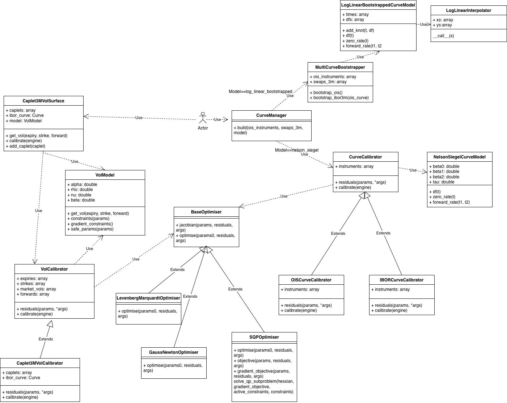

# QuantFin

>**Disclaimer:** QuantFin is an educational project. It is **not intended for production use** or for making real financial decisions. Use at your own risk. This library is designed for learning, experimentation, and research purposes only.

QuantFin is a lightweight Python library for interest-rate derivatives and curves.  
It provides tools for building discount and forecasting curves, pricing standard interest-rate instruments, and exploring volatility modeling.  
The library is designed to be educational, modular, and extensible, making it easy to experiment with multi-curve frameworks and volatility calibration techniques.

---

## Features

### Curve Construction & Instrument Pricing
- OIS discounting curve construction
- IBOR forecasting curve (currently 3M)
- Nelson-Siegel curve fit
- Sequential curve bootstrapping with log linear interpolation of discount factors
- Swap pricing: OIS swaps and 3M swaps

### Volatility & Calibration
- Generic volatility surface and calibrator
- SABR-style parameter fitting to market volatilities
- Caplet-specific calibration
- Constrained optimiser implemented with a combination of SQP and Gauss-Newton step

---

## Quick Start

### Install
```
pip install -r requirements.txt
```

# QuantFin Examples

---

## Example 1: Bootstrapping Swap Curves

See: `examples/example_bootstrap.py`

```python
from quantfin.instruments.ois_swap import OISSwap
from quantfin.instruments.swap_3m import Swap3M
from quantfin.instruments.ois_future import OISFuture
from quantfin.curves.curve_manager import CurveManager

# Explicit market data
ois_futures = [
    OISFuture(0.25, 0.9810),
    OISFuture(0.50, 0.9805),
    OISFuture(0.75, 0.9800),
    OISFuture(1.00, 0.9795),
    OISFuture(1.25, 0.9790),
    OISFuture(1.50, 0.9785),
    OISFuture(1.75, 0.9780)
]

ois_swaps = [
    OISSwap(2.00, 0.0220),
    OISSwap(3.00, 0.0240),
]

swaps3m = [
    Swap3M(0.25, 0.010),
    Swap3M(0.50, 0.012),
    Swap3M(0.75, 0.015),
    Swap3M(1.00, 0.030),
    Swap3M(1.25, 0.035),
    Swap3M(1.50, 0.038)
]

ois_instruments = ois_futures + ois_swaps

curve_manager = CurveManager()
curves = curve_manager.build(ois_instruments, swaps3m)

ois_curve = curves["ois"]
ibor_curve = curves["3m"]

print("Discount factor for T=1.0:", ois_curve.df(1.0))
print("Forward rate from 1.0 to 1.25:", ibor_curve.forward_rate(1.0, 1.25))
```

---

## Example 2: Pricing Swaps

See: `examples/example_bootstrap.py`

```python
from quantfin.instruments.ois_swap import OISSwap
from quantfin.instruments.swap_3m import Swap3M

# Assume curves are already bootstrapped
ois_curve = ...
ibor_curve = ...

# Price an OIS swap
ois_swap = OISSwap(3.0, 0.023, 100)
price = ois_swap.price(ois_curve)
print("OIS Swap price:", price)

# Price a 3M swap
swap3m = Swap3M(3.0, 0.050, 100)
price = swap3m.price(ois_curve, ibor_curve)
print("3M Swap price:", price)
```

---

## Example 3: Volatility Calibration

See: `examples/example_vol_calibration.py`

```python
from quantfin.vol.vol_surface import VolSurface

market_options = [
    { "expiry": 1.0, "strike": 100, "market_vol": 0.2, "forward": 99 },
    { "expiry": 1.0, "strike": 105, "market_vol": 0.22, "forward": 99 },
    { "expiry": 2.0, "strike": 100, "market_vol": 0.21, "forward": 98 },
    { "expiry": 2.0, "strike": 105, "market_vol": 0.23, "forward": 98 }
]

expiry_list = [opt["expiry"] for opt in market_options]
strike_list = [opt["strike"] for opt in market_options]
market_vol_list = [opt["market_vol"] for opt in market_options]
forward_list = [opt["forward"] for opt in market_options]

vol_surface = VolSurface(expiry_list, strike_list, market_vol_list, forward_list)
vol_surface.calibrate()

print("Implied vol for T=1.5, K=102, F=98.5:", vol_surface.get_vol(1.5, 102, 98.5))
print("Implied vol for T=1, K=100, F=99:", vol_surface.get_vol(1, 100, 99))
print("Implied vol for T=2, K=105, F=98:", vol_surface.get_vol(2, 105, 98))
```

---

## Example 4: Pricing a Caplet

See: `examples/example_caplet_pricing.py`

```python
from quantfin.vol.caplet3m_vol_surface import Caplet3MVolSurface
from quantfin.instruments.caplet_3m import Caplet3M
from quantfin.bootstrap.bootstrapper import MultiCurveBootstrapper
from examples.data.markets import CAPLETS_3M, OIS_SWAPS, SWAPS_3M

caplets_3m = CAPLETS_3M # List of Caplet3M instruments
ois_swaps = OIS_SWAPS   # List of OISSwap instruments
swaps3m = SWAPS_3M      # List of 3M Swap instruments

bootstrapper = MultiCurveBootstrapper(ois_swaps, swaps3m)
curves = bootstrapper.fit()
ois_curve = curves["ois"]
ibor_curve = curves["3m"]

vol_surface = Caplet3MVolSurface(caplets=caplets_3m, ibor_curve=ibor_curve)
vol_surface.calibrate()

# Price a single caplet
caplet = Caplet3M(1.5, 0.042, 1, None)  # expiry, strike, notional, market_vol placeholder
price = caplet.price(ois_curve, ibor_curve, vol_surface)
print("Caplet price:", price)
```

---

### Notes

* Explicit market data is included for Example 1 to show how bootstrapping works. Other examples use placeholders (`[...]`) to focus on API usage rather than data preparation.

# Library Structure

## Class Diagram


## Key Flows
For both curve construction and vol surface calibration, the general pattern is a class that acts as a user interface, a calibrator-like class that then calls into an optimiser (depending on its implementation) that optimises the parameters. Model-specific mathematics would live in specific model files (e.g. NelsonSiegelCurveModel, VolModel, etc.) which get passed into the residuals used for optimisation via the calibrator

### Nelson Siegel Curve Calibration
1. User passes in instruments into CurveManager and calls build()
2. CurveManager calls CurveCalibrator's calibrate()
3. CurveCalibrator calls the BaseOptimiser's optimise function, passing in the residuals that are a function of NelsonSiegelCurveModel
4. Optimiser returns the calibrated params to the CurveCalibrator
5. CurveCalibrator returns OIS and 3M Ibor curves based on the calibrated NelsonSiegel model params to the CurveManager
6. CurveManager returns the same curves for the user to use to get dfs/pricing, etc.

### Vol Surface Calibration (3M Caplet specific)
1. User passes in caplets into Caplet3MVolSurface and calls calibrate()
2. Caplet3MVolSurface calls VolCalibrator's calibrate()
3. VolCalibrator calls the BaseOptimiser's optimise function, passing in the residuals that are a function of VolModel
4. Optimiser returns the calibrated params to VolCalibrator
5. VolCalibrator returns a VolModel object with the calibrated params to the Caplet3MVolSurface
6. The user can now call get_vol on the Caplet3MVolSurface object which will obtain vols based on the fitted params

## Key Class Descriptions

### CurveManager
User interface to curve calibration functionality, lets user pass in curve construction instruments and returns them the curves that you can call e.g. df/forward_rate and price instruments with

### MultiCurveBootstrapper
Point of entry for bootstrapping curves. Used by CurveManager when building the curve when model==log_linear_bootstrapped

### LogLinearBootstrappedCurveModel
Handles model logic to extract numbers from bootstrapped curve, e.g. df, forward_rates, etc.

### LogLinearInterpolator
Helper class that given data points lets you interpolate values between them

### CurveCalibrator
Handles parameter pass into optimiser including residuals definition, called by CurveManager when building the curve when model==nelson_siegel. Inherited by OISCurveCalibrator and IBORCurveCalibrator who implement their own residuals functions based on their instruments

### NelsonSiegelCurveModel
Handles model logic for NelsonSiegel, takes in the parameters (e.g. beta0, beta1, etc.) and exposes functions for key values, e.g. df and forward_rates

### Caplet3MVolSurface
User interface to caplet vol calibration, lets user pass in caplets as instruments, call calibrate and also get vols from after calibration

### VolModel
Handles model logic for closed form Hagan vol formula, takes in the parameters (e.g. alpha, rho, nu, beta etc.) and exposes functions to get vols based on these parameters

### VolCalibrator
Handles parameter pass into optimiser, called by VolSurface when calling calibrate

### BaseOptimiser
Base class for optimisers, inherited by GaussNewtonOptimiser, LevenbergMarquardtOptimiser and SQPOptimiser with their own optimise() implementations

# Future Work

### 1. Curve Construction
- Support additional IBOR tenors (1m, 6m) via basis swaps
- Cubic spline interpolation
- Tests for interpolated values, not just at knots

### 2. Volatility Calibration
- Per-expiry smile calibration instead of global calibration performed currently
- Pricing and Product-specific SABR calibration for:
  - Swaptions

### 3. General Pricing
- Build Monte Carlo pricer for more complex payoffs, e.g. digital caplets

### 4. General Optimisation
- Performance tracking, e.g. residuals/RMSE over time, etc.
- Better handling of singular values in calibration
- More aggressive step sizes combined with trust region guardrails, instead of current 0.5 multiplier
- Caching for discount factors used in pricing 

# Referenced Literature

- Interest Rate Bootstrapping Explained by XAIA Investment
- A Teaching Note on Pricing and Valuing Interest Rate Swaps using LIBOR and OIS Discounting by Donald J. Smith
- Interpolation Methods for Curve Construction by Hagan
- Interest Rate Models - Theory and Practice by Brigo and Mercurio
- Parsimonious Modelling of Yield Curves by Nelson and Siegel
- Options, Futures and Other Derivatives by Hull
- Managing Smile Risk by Hagan
- Equivalent Black Volatilities by Hagan
- Options, Futures and Other Derivatives by Hull
- Numerical Optimization by Nocedal
